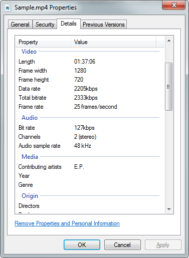
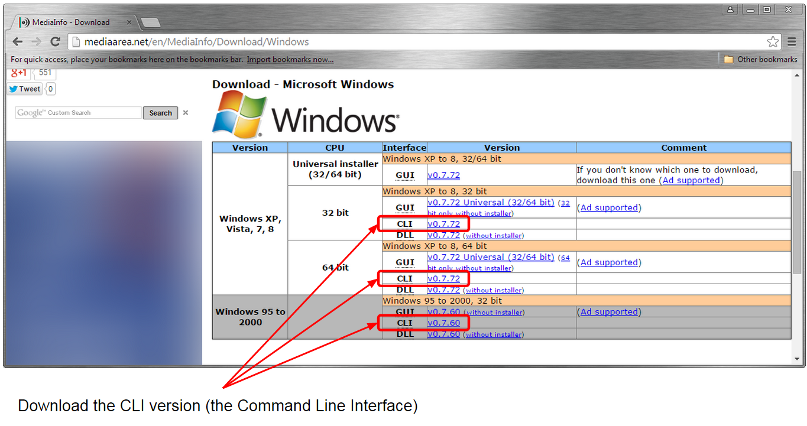

The Windows operating system ([Homepage](http://windows.microsoft.com/en-gb/windows/home)) provides useful information about video files playable by Windows Media Player ([Homepage](http://windows.microsoft.com/en-us/windows/windows-media-player)).  This information includes the video length, frame width and height and other similar properties as shown in the following image.



Unfortunately there is no Java API which can easily retrieve such information.  Instead we need to rely on third party native libraries such as MediaInfo ([Homepage](https://mediaarea.net/en/MediaInfo)) and create wrappers around it.  In this article we will see how to use the aforementioned third party native library to retrieve the video properties from a Java application.  Please note that the examples shown in this article are based on the Windows 64 bit version of Command Line Interface version 0.7.72.  Different MediaInfo versions may produce different outputs that those shown here.

All code listed below is available at: [https://github.com/javacreed/how-to-retrieve-the-video-properties](https://github.com/javacreed/how-to-retrieve-the-video-properties).  Most of the examples will not contain the whole code and may omit fragments which are not relevant to the example being discussed. The readers can download or view all code from the above link.

This article starts from the configuration process, where it describes from where to download the required libraries and how to use them in Java code.  The second section shows how to call the native library from within Java while the third and final section describes the parsing process.

## Configuration

As mentioned already, the examples shown in this article make use of a third party native library named MediaInfo, which library can be downloaded from: (http://mediaarea.net/en/MediaInfo/Download)[http://mediaarea.net/en/MediaInfo/Download].   As shown in the following image, the MediaInfo comes in several flavours.  For the purpose of this article, we only need the Command Line Interface version.



**Please make sure you read the terms and conditions before downloading this library**.

Once downloaded, extract the ZIP file and update the `mediainfo.properties` file, located under the `resources` folder (within the article project and not in the just extracted ZIP file).  The following example shows my copy of the properties file, which points to the location where the `MediaInfo.exe` file was extracted.

```
# =============================================================================
# The 'MediaInfo.exe' can be downloaded from:
#   http://mediaarea.net/en/MediaInfo/Download/Windows .  
# The command line (CLI) version is required by this example
# =============================================================================
mediainfo.cli.path=C:\\Users\\Java Creed\\Downloads\\MediaInfo_CLI_0.7.72_Windows_x64\\MediaInfo.exe
# =============================================================================
```

The highlighted part needs to be modified to the path where you extracted your copy of `MediaInfo.exe`.  In the event that this property is not configure properly, a `FileNotFoundException` ([Java Doc](http://docs.oracle.com/javase/7/docs/api/java/io/FileNotFoundException.html)) will be thrown as shown next.

```
Exception in thread "main" java.io.FileNotFoundException: The value of the property 'mediainfo.cli.path' does not point to a file
	at com.javacreed.examples.mediainfo.MediaInfoUtil.getMediaInfoCliPath(MediaInfoUtil.java:72)
	at com.javacreed.examples.mediainfo.MediaInfoUtil.executeMediaInfo(MediaInfoUtil.java:36)
	at com.javacreed.examples.mediainfo.MediaInfoUtil.getMediaInfo(MediaInfoUtil.java:57)
	at com.javacreed.examples.mediainfo.Example.main(Example.java:29)
	at sun.reflect.NativeMethodAccessorImpl.invoke0(Native Method)
	at sun.reflect.NativeMethodAccessorImpl.invoke(NativeMethodAccessorImpl.java:57)
	at sun.reflect.DelegatingMethodAccessorImpl.invoke(DelegatingMethodAccessorImpl.java:43)
	at java.lang.reflect.Method.invoke(Method.java:601)
	at com.intellij.rt.execution.application.AppMain.main(AppMain.java:134)
```

In this case please make sure that the provided path is correct and that the backslashes (`\`) are escaped.

## Media Info

The `MediaInfo.exe` file is an executable file that takes the path of the video as a command line argument and prints the video properties to the same command prompt.  This can be executed as shown next from the command prompt.

```
MediaInfo.exe "C:\Users\Java Creed\Pixar\Boundin.mkv"
```

This example refers to a short movie by Pixar ([Homepage](http://www.pixar.com/)) named Boundin&#39;
 ([Wiki](http://en.wikipedia.org/wiki/Boundin%27)).  The video path contains a space and thus needs to be enclosed within the double quote (`"`) so that the command line interface treats this as a single argument.  The `MediaInfo.exe` prints a formatted string, similar to the one shown below, listing all properties of the given video.

```
General
Unique ID                                : 243366064654295455569390741576099105942 (0xB7169961031FDA2CBBBF81DB9D010C96)
Complete name                            : C:\Users\Java Creed\Pixar\Boundin.mkv
Format                                   : Matroska
Format version                           : Version 2
File size                                : 224 MiB
Duration                                 : 4mn 42s
Overall bit rate                         : 6 633 Kbps
Encoded date                             : UTC 2010-10-11 09:22:18
Writing application                      : mkvmerge v4.0.0 ('The Stars were mine') built on Jun  6 2010 16:18:42
Writing library                          : libebml v1.0.0 + libmatroska v1.0.0

Video
ID                                       : 1
Format                                   : AVC
Format/Info                              : Advanced Video Codec
Format profile                           : High@L4.1
Format settings, CABAC                   : Yes
Format settings, ReFrames                : 4 frames
Codec ID                                 : V_MPEG4/ISO/AVC
Duration                                 : 4mn 42s
Bit rate                                 : 6 003 Kbps
Width                                    : 1 920 pixels
Height                                   : 1 040 pixels
Display aspect ratio                     : 1.85:1
Frame rate mode                          : Constant
Frame rate                               : 23.976 fps
Color space                              : YUV
Chroma subsampling                       : 4:2:0
Bit depth                                : 8 bits
Scan type                                : Progressive
Bits/(Pixel*Frame)                       : 0.125
Stream size                              : 198 MiB (88%)
Writing library                          : x264 core 105 r1732 2b04482
Encoding settings                        : cabac=1 / ref=4 / deblock=1:0:0 / analyse=0x3:0x133 / me=umh / subme=7 / psy=1 / psy_rd=1.00:0.00 / mixed_ref=1 / me_range=16 / chroma_me=1 / trellis=1 / 8x8dct=1 / cqm=0 / deadzone=21,11 / fast_pskip=0 / chroma_qp_offset=-2 / threads=6 / sliced_threads=0 / nr=0 / decimate=1 / interlaced=0 / constrained_intra=0 / bframes=3 / b_pyramid=2 / b_adapt=1 / b_bias=0 / direct=1 / weightb=1 / open_gop=0 / weightp=2 / keyint=250 / keyint_min=23 / scenecut=40 / intra_refresh=0 / rc_lookahead=40 / rc=2pass / mbtree=1 / bitrate=6003 / ratetol=1.0 / qcomp=0.60 / qpmin=10 / qpmax=51 / qpstep=4 / cplxblur=20.0 / qblur=0.5 / ip_ratio=1.40 / aq=1:1.00
Language                                 : English
Default                                  : No
Forced                                   : No

Audio
ID                                       : 2
Format                                   : AC-3
Format/Info                              : Audio Coding 3
Mode extension                           : CM (complete main)
Format settings, Endianness              : Big
Codec ID                                 : A_AC3
Duration                                 : 4mn 42s
Bit rate mode                            : Constant
Bit rate                                 : 640 Kbps
Channel(s)                               : 6 channels
Channel positions                        : Front: L C R, Side: L R, LFE
Sampling rate                            : 48.0 KHz
Bit depth                                : 16 bits
Compression mode                         : Lossy
Stream size                              : 21.6 MiB (10%)
Language                                 : English
Default                                  : Yes
Forced                                   : No
```

The output shown above comprise from three sections, the _General_, the _Video_ and the _Audio_ sections.  The _General_ section contains general information about the video such as the path and the size, which section is always available.  The _Video_ and the _Audio_ sections contain visual and audio related information respectively and are only shown when such information is available.  For example, a video without sound will not have the _Audio_ section.  Furthermore, a video that includes chapters will have information related to the chapters which information will be found under the _Chapters_ section.  The video used in this example does not contain chapters and thus we do not have this section.

The `ProcessBuilder` ([Java Doc](http://docs.oracle.com/javase/7/docs/api/java/lang/ProcessBuilder.html)) class allows us to invoke system commands similar to the one shown above and capture the created output.  The following example captures this.

```java
package com.javacreed.examples.mediainfo;

import java.io.File;
import java.io.FileNotFoundException;
import java.io.IOException;
import java.io.InputStreamReader;
import java.io.Reader;
import java.util.Properties;

public class MediaInfoUtil {

  private static String MEDIA_INFO_CLI_PATH;

  public static String executeMediaInfo(final String mediaPath) throws IOException, InterruptedException {
    final String exePath = MediaInfoUtil.getMediaInfoCliPath();
    final ProcessBuilder builder = new ProcessBuilder(exePath, mediaPath);
    builder.redirectErrorStream(true);
    final Process process = builder.start();

    final StringBuilder buffer = new StringBuilder();
    try (Reader reader = new InputStreamReader(process.getInputStream())) {
      for (int i; (i = reader.read()) != -1;) {
        buffer.append((char) i);
      }
    }

    final int status = process.waitFor();
    if (status == 0) {
      return buffer.toString();
    }

    throw new IOException("Unexpected exit status " + status);
  }

  public static MediaInfo getMediaInfo(final String mediaPath) throws IOException, InterruptedException {
    return MediaInfo.parse(MediaInfoUtil.executeMediaInfo(mediaPath));
  }

  private static String getMediaInfoCliPath() throws IOException {
    if (MediaInfoUtil.MEDIA_INFO_CLI_PATH == null) {
      final Properties properties = new Properties();
      properties.load(MediaInfoUtil.class.getResourceAsStream("/mediainfo.properties"));

      final String exePath = properties.getProperty("mediainfo.cli.path");
      if (exePath == null) {
        throw new IOException("The property 'mediainfo.cli.path' is not set");
      }

      final File file = new File(exePath).getAbsoluteFile();
      if (false == file.isFile()) {
        throw new FileNotFoundException("The value of the property 'mediainfo.cli.path' does not point to a file");
      }

      MediaInfoUtil.MEDIA_INFO_CLI_PATH = file.getAbsolutePath();
    }

    return MediaInfoUtil.MEDIA_INFO_CLI_PATH;
  }

  private MediaInfoUtil() {}
}
```

The `MediaInfoUtil` class provides a wrapper to the `MediaInfo.exe` file and returns a Java object with all information produced by the same executable.  This class is quite long.  Let us break it into smaller parts and describe each part respectively.

1. The class has a `private` constructor.  This was made `private` intentionally as there is no need to initialise this call.  All methods are `static` and the sole field, `MEDIA_INFO_CLI_PATH` is `static` too.

    ```java
      private MediaInfoUtil() {}
    ```

    This class acts as a singleton ([Wiki](http://en.wikipedia.org/wiki/Singleton_pattern)) or better as a utilities class.

1. The method `getMediaInfoCliPath()` returns the path to the `MediaInfo.exe` after verifying that this path points to a file.

    ```java
      private static String getMediaInfoCliPath() throws IOException {
        if (MediaInfoUtil.MEDIA_INFO_CLI_PATH == null) {
          final Properties properties = new Properties();
          properties.load(MediaInfoUtil.class.getResourceAsStream("/mediainfo.properties"));

          final String exePath = properties.getProperty("mediainfo.cli.path");
          if (exePath == null) {
            throw new IOException("The property 'mediainfo.cli.path' is not set");
          }

          final File file = new File(exePath).getAbsoluteFile();
          if (!file.isFile()) {
            throw new FileNotFoundException("The value of the property 'mediainfo.cli.path' does not point to a file");
          }

          MediaInfoUtil.MEDIA_INFO_CLI_PATH = file.getAbsolutePath();
        }
    ```

    If the static field `MEDIA_INFO_CLI_PATH` is set, then returns its value, otherwise it loads the property file `/mediainfo.properties` and verifies that this path points to a file.  If the property is missing or does not point to a file, a `FileNotFoundException` is thrown.  This will produce the error mentioned at the end of the _Configuration_ section.

    Please note that the absolute path to the `MediaInfo.exe` file is returned.  This is important for the `ProcessBuilder` class to work as required.

1. The method `executeMediaInfo()` is responsible from creating the wrapper for the `MediaInfo.exe` and capturing its output as shown next.

    ```java
      public static String executeMediaInfo(final String mediaPath) throws IOException, InterruptedException {
        final String exePath = MediaInfoUtil.getMediaInfoCliPath();
        final ProcessBuilder builder = new ProcessBuilder(exePath, mediaPath);
        builder.redirectErrorStream(true);
        final Process process = builder.start();

        final StringBuilder buffer = new StringBuilder();
        try (Reader reader = new InputStreamReader(process.getInputStream())) {
          for (int i; (i = reader.read()) != -1;) {
            buffer.append((char) i);
          }
        }

        final int status = process.waitFor();
        if (status == 0) {
          return buffer.toString();
        }

        throw new IOException("Unexpected exit status " + status);
      }
    ```

    Given its importance, we will split this method further and describe each respective part.

    a. This method starts by retrieving the absolute path to the `MediaInfo.exe` file.  The `ProcessBuilder` will fail if this path is not absolute.

        ```java
            final String exePath = MediaInfoUtil.getMediaInfoCliPath();
            final ProcessBuilder builder = new ProcessBuilder(exePath, mediaPath);
            builder.redirectErrorStream(true);
            final Process process = builder.start();
        ```

        The error stream, where errors are printed, is redirected to the output stream so we only have to deal with one stream.  This is quite important as otherwise we can experience something similar to a deadlock (in theory this is not a deadlock but has the same effect).  If enough errors are produced, the error buffer will get full and will stop the application from writing more errors.  The application will not be able to proceed until the error buffer is emptied, thus waits forever.  Using this approach the errors are written to the output stream and thus the error stream will never get full.  Furthermore, as we will see next we will read all output produced to the standard stream and this will never get full.

     a. Once the process is started, we need to start reading the output produced by the process, otherwise the process may block until the produced stream is consumed.  We can do this by using the `process.getInputStream()`, which returns the standard output stream produced by the same process.

        ```java
            final StringBuilder buffer = new StringBuilder();
            try (Reader reader = new InputStreamReader(process.getInputStream())) {
              for (int i; (i = reader.read()) != -1;) {
                buffer.append((char) i);
              }
            }
        ```

        Please note that error stream is redirected to the standard stream.  Therefore the above code fragment will capture both streams.  Furthermore, the above loop will keep iterating until the process has finished.  The method `Reader.read()` ([Java Doc](http://docs.oracle.com/javase/7/docs/api/java/io/Reader.html#read())) will block until either there are more characters to be read or the stream is closed, in which case `-1` is returned.

     a. Finally we will wait for the process to finish and retrieve the process exit code.

        ```java
            final int status = process.waitFor();
            if (status == 0) {
              return buffer.toString();
            }
        ```

        In the event the process finished gracefully (that is the exit code is 0), then return the output produced by the same process.  Otherwise throw an `IOException` to indicate that process finished abnormally.

        ```java
            throw new IOException("Unexpected exit status " + status);
        ```

As we saw in this section, the `MediaInfoUtil` provides a wrapper to the `MediaInfo.exe`.  The next section describes how the output produced by the `MediaInfo.exe` is parsed into Java Objects.

## Parsing

The next step once we have the output produced by the `MediaInfo.exe` is to parse it into Java Objects.  And to help us with this we will create a set of classes that can be constructed from the produced output.

We can divide the output into three parts, the whole information, the section information and the line information.  The line information, such as the one shown next is represented by the class `NameValue`.

```
Format                                   : AVC
```

The following example shows the `NameValue`, which is the class representing the line information.

```java
package com.javacreed.examples.mediainfo;

import java.util.Objects;

public class NameValue {

  public static NameValue parse(final String line) throws IllegalArgumentException {
    if (false == line.contains(" : ")) {
      throw new IllegalArgumentException("The line is expected to have a ' : '");
    }

    final String[] parts = line.split(" : ", 2);
    return new NameValue(parts[0].trim(), parts[1].trim());
  }

  private final String name;
  private final String value;

  private NameValue(final String name, final String value) {
    this.name = Objects.requireNonNull(name);
    this.value = Objects.requireNonNull(value);
  }

  /* Other methods removed for brevity */
```

The line information comprise name and value and is delimited by a colon (`:`). The line information is formatted using a fixed width, therefore we can use this information to split the line into a name and a value.  Instead the `NameValue` class uses the string `" : "` (space colon space) as a delimiter to be more flexible as shown next.

```java
  public static NameValue parse(final String line) throws IllegalArgumentException {
    if (!line.contains(" : ")) {
      throw new IllegalArgumentException("The line is expected to have a ' : '");
    }

    final String[] parts = line.split(" : ", 2);
    return new NameValue(parts[0].trim(), parts[1].trim());
  }
```

The section information is represented by the `Section` and is shown next.

```java
package com.javacreed.examples.mediainfo;

import java.util.LinkedHashMap;
import java.util.Map;
import java.util.Objects;

public class Section {
  public static Section parse(final String line) throws IllegalArgumentException {
    if (line.contains(":")) {
      throw new IllegalArgumentException("Section name should not have ':'");
    }

    return new Section(line.trim());
  }

  private final String name;

  private final Map<String, NameValue> values = new LinkedHashMap<>();

  private Section(final String name) {
    this.name = Objects.requireNonNull(name);
  }

  public void add(final NameValue nameValue) throws IllegalArgumentException {
    final String name = nameValue.getName();
    if (values.containsKey(name)) {
      throw new IllegalArgumentException("Duplicate name: '" + name + "'");
    }

    values.put(name, nameValue);
  }

  public String get(final String valueName) {
    final NameValue nameValue = values.get(valueName);
    if (nameValue == null) {
      return null;
    }

    return nameValue.getValue();
  }

  /* Other methods removed for brevity */
}
```

The `Section` class comprise a name and a collection of name value pairs.  Similar to the `NameValue` class, the `Section` has its own `parse()` method.  The section contains a collection of line items, which is represented by the field `values`.  The parsed `NameValue`s are added to the `Section` class through the `add()` method which verifies name uniqueness. A section cannot have two items with the same name.

All sections are grouped by the `MediaInfo` class shown next.

```java
package com.javacreed.examples.mediainfo;

import java.util.LinkedHashMap;
import java.util.Map;
import java.util.Objects;

public class MediaInfo {

  public static MediaInfo parse(final String data) throws IllegalArgumentException {

    final MediaInfo mediaInfo = new MediaInfo(data);

    Section section = null;

    for (final String line : data.split("(\\r\\n|\\r|\\n)")) {
      if (line.isEmpty()) {
        section = null;
        continue;
      }

      if (section == null) {
        section = mediaInfo.addSection(Section.parse(line));
        continue;
      }

      section.add(NameValue.parse(line));
    }

    return mediaInfo;
  }

  private final String rawData;
  private final Map<String, Section> sections = new LinkedHashMap<>();

  private MediaInfo(final String rawData) {
    this.rawData = Objects.requireNonNull(rawData);
  }

  private Section addSection(final Section section) throws IllegalArgumentException {
    final String name = section.getName();
    if (sections.containsKey(name)) {
      throw new IllegalArgumentException("Duplicate section name: '" + name + "'");
    }

    sections.put(name, section);
    return section;
  }

  public String get(final String sectionName, final String valueName) {
    final Section section = sections.get(sectionName);
    if (section == null) {
      return null;
    }
    return section.get(valueName);
  }

  /* Other methods removed for brevity */
}
```

The `parse()` method of the `MediaInfo` class takes the whole output produced by `MediaInfo.exe` and creates all necessary objects.  It starts by splitting the output into lines (using the regular expression `data.split("(\\r\\n|\\r|\\n)")`) and then process each line.  It creates the sections and fill each section with the respective line information.

The following example shows how this can be used.

```java
package com.javacreed.examples.mediainfo;

public class Example {

  public static void main(final String[] args) throws Exception {
    final String mediaPath = "C:\\Users\\Java Creed\\Pixar\\Boundin.mkv";

    final MediaInfo mediaInfo = MediaInfoUtil.getMediaInfo(mediaPath);

    final String[] properties = { "Width", "Height", "Format", "Duration" };
    for (final String property : properties) {
      System.out.printf("[%s] = '%s'%n", property, mediaInfo.get("Video", property));
    }
  }
}
```

This example refers to a short movie by Pixar named Boundin and produces the following information.

```java
[Width] = '1 920 pixels'
[Height] = '1 040 pixels'
[Format] = 'AVC'
[Duration] = '4mn 42s'
```

## Conclusion

The MediaInfo native library provides useful information about many kinds of video media file, which information includes video information, audio information, and chapter information to name some.  This library provides more information that the native Windows properties dialog which depends on the Windows Media Player for such information.  Since that the MediaInfo is a native library, we need a wrapper which invokes it and capture its output in Java.  This output is then parsed into Java objects which can be easily used as shown in the above examples.
